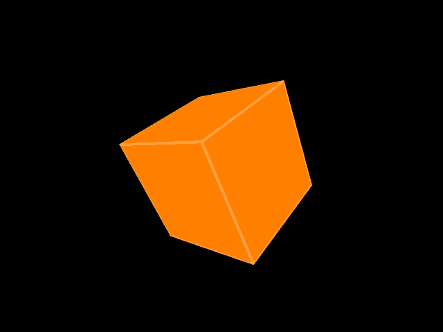
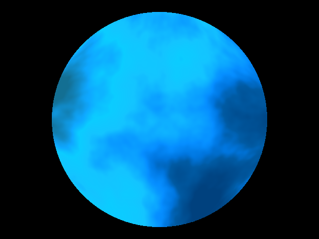
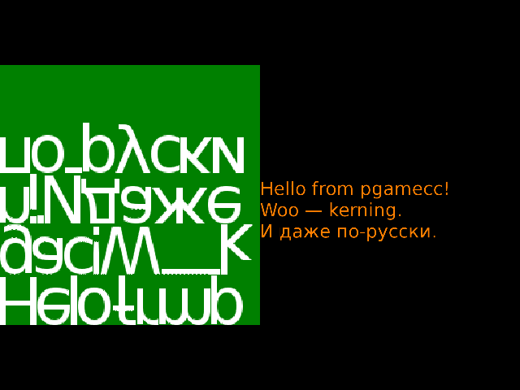

**pgamecc** is a small library for making OpenGL games in C++. It does not aim
to be general-purpose, on the contrary, it was created for the specific purpose
of consolidating common code from two games I'm working on.

##### Features

For display and interaction:
- create a window with fullscreen switching (using GLFW)
- OpenGL object wrappers:
  - shader
  - buffer
  - texture
- frame and step rate stability control (planned)
- text rendering (using FreeType)
- simple widgets (in progress)

For procedural graphics:
- color space transformations
- image object as a sampling of a function
- random numbers (wrappers for \<random>)
- Perlin noise (wrapper for libnoise)

For game mechanics:
- hexagonal grid calculations
- 3D integer grid calculations

##### Screenshots

